# Clash Guardian Pro v1.0.8 - 澶氬唴鏍告櫤鑳藉畧鎶よ繘绋?

涓€涓櫤鑳藉寲鐨?Windows 绯荤粺鎵樼洏搴旂敤锛岀敤浜庤嚜鍔ㄧ洃鎺у拰缁存姢 Clash 绯诲垪浠ｇ悊瀹㈡埛绔殑绋冲畾杩愯銆?

Icon based on Clash Verge, modified background by [Tao Zheng].

**鏀寔澶氱瀹㈡埛绔拰鍐呮牳锛?*
- Clash Verge / Clash Verge Rev (verge-mihomo)
- Mihomo Party (mihomo)
- Clash Nyanpasu (clash-rs / mihomo)
- Clash for Windows (clash / clash-win64)
- 鍘熺増 Clash Meta (clash-meta)

## 鉁?鍔熻兘鐗规€?

### 馃攳 鏅鸿兘鐩戞帶
- **澶氬唴鏍告敮鎸?* - 鑷姩妫€娴嬪苟閫傞厤涓嶅悓 Clash 瀹㈡埛绔拰鍐呮牳
- **杩涚▼鐩戞帶** - 瀹炴椂妫€娴嬪唴鏍歌繘绋嬬姸鎬侊紙鑷姩璇嗗埆杩涚▼鍚嶏級
- **鍐呭瓨鐩戞帶** - 鐩戞帶鍐呭瓨鍗犵敤锛岄槻姝㈠唴瀛樻硠婕?
- **寤惰繜娴嬮噺** - 涓嶅彧娴嬮€氭柇锛岃繕娴嬮噺瀹為檯寤惰繜
- **澶氱洰鏍囨祴璇?* - 鍚屾椂娴嬭瘯 Google銆丆loudflare锛岄伩鍏嶈鍒?
- **TCP 杩炴帴缁熻** - 鐩戞帶 TIME_WAIT銆丒STABLISHED銆丆LOSE_WAIT 杩炴帴鏁?
- **API 鑷姩鍙戠幇** - 鑷姩灏濊瘯甯哥敤绔彛锛?097, 9090, 7890, 9898锛?
- **鑺傜偣鍚嶇О鏄剧ず** - 姝ｇ‘瑙ｆ瀽 Unicode锛岃繃婊?emoji 涔辩爜

### 鈿?鑷€傚簲妫€娴?
- **鍩虹闂撮殧**锛歚normalInterval`锛堥粯璁?5 绉掞級/ `fastInterval`锛堥粯璁?1 绉掞級
- **鎻愰€熺郴鏁?*锛歚speedFactor`锛堥粯璁?3锛岃寖鍥?1..5锛夛紝瀹為檯妫€娴嬮棿闅?= 鍩虹闂撮殧 / `speedFactor`
- **榛樿鏁堟灉**锛氬仴搴锋€佺害 1.6 绉掍竴娆℃娴嬶紙>=3x 鎻愰€燂級锛屽紓甯告€佺害 0.33 绉掑揩閫熸娴?
- **杩炵画绋冲畾 3 娆″悗**锛氳嚜鍔ㄦ仮澶嶆甯搁棿闅?

### 馃 鏅鸿兘鍐崇瓥
- **绾嚱鏁板喅绛栧紩鎿?* - `EvaluateStatus` 杩斿洖缁撴瀯鍖栧喅绛栫粨鏋滐紝閫昏緫涓?UI 鍒嗙
- **鏅鸿兘浠ｇ悊缁勮瘑鍒?* - 鑷姩鍙戠幇瀹為檯鑺傜偣鎵€灞炵殑 Selector 缁勶紝骞惰嚜鍔ㄩ伩寮€鏃犲€欓€夎妭鐐圭殑杈呭姪缁勶紙濡備粎 `Proxy/DIRECT` 鐨勬父鎴忚矾鐢辩粍锛?- **鑺傜偣榛戝悕鍗?* - 澶辫触鑺傜偣 20 鍒嗛挓鍐呬笉鍐嶄娇鐢?
- **寤惰繜浼樺寲** - 寤惰繜杩囬珮鑷姩鍒囨崲鑺傜偣
- **缁煎悎鍒ゆ柇** - 鍐呭瓨楂樹絾缃戠粶姝ｅ父鏃朵笉閲嶅惎
- **瀹氭湡娴嬮€?* - 绾︽瘡 6 鍒嗛挓瑙﹀彂鍏ㄨ妭鐐瑰欢杩熸祴璇?
- **绂佺敤鍚嶅崟锛堝彲鍕鹃€夛級** - 鎵樼洏鈥滅鐢ㄥ悕鍗曗€濆嬀閫夎妭鐐瑰啓鍏?`disabledNodes`锛涙湭閰嶇疆鏃朵粛鎸?`excludeRegions` 鍏抽敭瀛楁帓闄わ紙榛樿娓境鍙帮級
- **鍋忓ソ鑺傜偣锛堝彲鍕鹃€夛級** - 鎵樼洏鈥滃亸濂借妭鐐光€濅細鍦ㄨ嚜鍔ㄥ垏鎹㈡椂浼樺厛閫夋嫨锛涘亸濂介泦鍚堣繃灏?涓嶇ǔ瀹氭椂鎶楅闄╀細涓嬮檷锛堜笉鍙敤鍒欏洖閫€锛?

### 鈿?鑷姩鎭㈠
- **璁㈤槄绾ц嚜鍔ㄥ垏鎹紙Clash Verge Rev锛?* - 杩炵画鑷姩鍒囨崲鑺傜偣浠嶄笉鍙敤鏃讹紝鎸夌櫧鍚嶅崟杞崲璁㈤槄骞跺己鍒堕噸鍚鎴风锛堥粯璁ゅ叧闂級

- **杩涚▼宕╂簝鑷姩閲嶅惎** - 妫€娴嬪埌杩涚▼涓嶅瓨鍦ㄦ椂鑷姩閲嶅惎鍐呮牳
- **鍒嗘鎭㈠绛栫暐** - 鏉€鍐呮牳鈫掔瓑寰呰嚜鍔ㄦ仮澶嶁啋鏈仮澶嶅垯閲嶅惎瀹㈡埛绔紙鏅鸿兘闄嶇骇锛?
- **闃插苟鍙戦噸鍚?* - `_isRestarting` + `restartLock` 闂ㄩ棭锛岄伩鍏嶅苟鍙戦噸鍚珵鎬?
- **鍐呭瓨杩囬珮鑷姩閲嶅惎** - 鍐呭瓨瓒呰繃 150MB 鏃犳潯浠堕噸鍚?
- **鏅鸿兘鑺傜偣鍒囨崲** - 浠ｇ悊鏃犲搷搴旀垨寤惰繜杩囬珮鏃惰嚜鍔ㄥ垏鎹㈠埌鏈€浼樿妭鐐?
- **蹇€熸仮澶?* - 閲嶅惎鍚庝富鍔ㄦ娴嬪唴鏍哥姸鎬侊紝涓€鏃︽仮澶嶇珛鍗冲垏鎹㈠埌姝ｅ父妯″紡
- **闈欓粯杩愯** - 鎵€鏈夋搷浣滈潤闊虫墽琛岋紝鏃犲脊绐楁墦鎵?

### 馃О 鎺у埗涓庤瘖鏂?
- **鏆傚仠妫€娴?* - 鏆傚仠鏁翠釜妫€娴嬪惊鐜紙涓嶆娴嬨€佷笉鑷姩鍒囨崲/閲嶅惎锛孶I 杩涘叆鈥滄殏鍋滄娴嬧€濈姸鎬侊級
- **涓€閿鍑鸿瘖鏂寘** - 鑷姩鑴辨晱 `clashSecret`锛屼究浜庢帓闅滃弽棣?
- **鎵樼洏宸ュ叿绠?* - 蹇€熸墦寮€閰嶇疆/鐩戞帶鏁版嵁/寮傚父鏃ュ織锛岀鐞嗛粦鍚嶅崟

### 馃攧 鑷姩鏇存柊
- **闈欓粯妫€鏌?* - 鍚姩鏃跺悗鍙版鏌?GitHub 鏈€鏂扮増鏈?
- **浠ｇ悊闄嶇骇** - 浼樺厛閫氳繃浠ｇ悊涓嬭浇锛屽け璐ヨ嚜鍔ㄥ垏鎹㈢洿杩?
- **鐑浛鎹?* - NTFS 鏂囦欢鐑浛鎹紝鏃犻渶鎵嬪姩鍏抽棴绋嬪簭
- **鍥炴粴淇濇姢** - 鏇存柊澶辫触鑷姩鎭㈠鏃х増鏈?

### 馃攷 瀹㈡埛绔矾寰勬櫤鑳藉彂鐜?
- **杩涚▼鎺㈡祴** - 浠庤繍琛屼腑杩涚▼鑾峰彇鍙墽琛屾枃浠惰矾寰勶紙鏈€鍑嗙‘锛?
- **璺緞鎸佷箙鍖?* - 妫€娴嬪埌鐨勮矾寰勪繚瀛樺埌 `config.json`锛屼笅娆″惎鍔ㄧ洿鎺ヨ鍙?
- **榛樿璺緞鍒楄〃** - 瑕嗙洊 15+ 绉嶅父瑙佸畨瑁呮柟寮?
- **娉ㄥ唽琛ㄦ悳绱?* - 浠?HKLM/HKCU Uninstall 閿嚜鍔ㄥ彂鐜板畨瑁呰矾寰勶紙鍏滃簳锛?

### 馃搳 鏁版嵁缁熻
- **闂娈佃惤娆℃暟** - UI 鍙粺璁♀€滄甯糕啋寮傚父鈥濈殑娆℃暟锛屽紓甯告寔缁笉閲嶅绱姞
- **鐩戞帶鏃ュ織** - 璁板綍鍏抽敭浜嬩欢鍒?`guardian.log`锛堜粎璁板綍寮傚父锛?
- **璇︾粏鏁版嵁** - 璁板綍姣忔妫€娴嬫暟鎹埌鎸夋棩鏈熷懡鍚嶇殑 CSV 鏂囦欢
- **鑷姩娓呯悊** - 鑷姩娓呯悊 7 澶╁墠鐨勬棩蹇楁枃浠?

## 馃枼锔?绯荤粺瑕佹眰

- Windows 10/11
- .NET Framework 4.5+
- 浠讳竴鏀寔鐨?Clash 瀹㈡埛绔凡瀹夎

## 鈿欙笍 閰嶇疆

### 閰嶇疆鏂囦欢锛堟帹鑽愶級

棣栨杩愯鏃朵細鑷姩鐢熸垚閰嶇疆鏂囦欢锛堥粯璁よ矾寰勶級锛?

- `%LOCALAPPDATA%\\ClashGuardian\\config\\config.json`

涔熷彲浠ラ€氳繃鎵樼洏鑿滃崟鐨?`鎵撳紑閰嶇疆` 蹇€熷畾浣嶃€?

```json
{
  "clashApi": "http://127.0.0.1:9097",
  "clashSecret": "set-your-secret",
  "proxyPort": 7897,
  "normalInterval": 5000,
  "fastInterval": 1000,
  "speedFactor": 3,
  "allowAutoStartClient": false,
  "memoryThreshold": 150,
  "memoryWarning": 70,
  "highDelayThreshold": 400,
  "highDelayConnOkExtraMs": 120,
  "highDelaySwitchConsecutiveConnOk": 4,
  "highDelaySwitchConsecutiveConnUnknown": 3,
  "closeWaitThresholdCore": 25,
  "closeWaitConsecutive": 3,
  "autoSwitchMaxPer10Min": 6,
  "autoRestartMaxPer10Min": 3,
  "autoRestartMinIntervalSeconds": 20,
  "switchStormSuppressSeconds": 60,
  "restartStormSuppressSeconds": 120,
  "blacklistMinutes": 20,
  "proxyTestTimeoutMs": 900,
  "connectivityTestUrls": ["http://www.gstatic.com/generate_204", "http://cp.cloudflare.com/generate_204", "http://www.msftconnecttest.com/connecttest.txt"],
  "connectivityProbeTimeoutMs": 3000,
  "connectivityProbeMinSuccessCount": 1,
  "connectivitySlowThresholdMs": 800,
  "connectivityProbeMinIntervalSeconds": 15,
  "connectivityResultMaxAgeSeconds": 30,
  "coreProcessNames": ["verge-mihomo", "mihomo", "clash-meta", "clash-rs", "clash", "clash-win64"],
  "clientProcessNames": ["Clash Verge", "clash-verge", "Clash Nyanpasu", "mihomo-party", "Clash for Windows"],

  "excludeRegions": ["HK", "棣欐腐", "TW", "鍙版咕", "MO", "婢抽棬"],
  "disabledNodes": [],
  "preferredNodes": [],

  "autoSwitchSubscription": false,
  "subscriptionSwitchThreshold": 3,
  "subscriptionSwitchCooldownMinutes": 15,
  "subscriptionWhitelist": [],

  "clientPath": "C:\\Users\\...\\Clash Verge.exe"
}
```

| 閰嶇疆椤?| 璇存槑 | 榛樿鍊?|
|--------|------|--------|
| `clashApi` | Clash API 鍦板潃 | `http://127.0.0.1:9097` |
| `clashSecret` | API 瀵嗛挜 | `set-your-secret` |
| `proxyPort` | 浠ｇ悊绔彛 | `7897` |
| `normalInterval` | 姝ｅ父妫€娴嬮棿闅?ms) | `5000` |
| `fastInterval` | 寮傚父鏃跺揩閫熸娴嬮棿闅?ms) | `1000` |
| `speedFactor` | 妫€娴嬫彁閫熺郴鏁帮紙瀹為檯闂撮殧=interval/speedFactor锛岃寖鍥?1..5锛?| `3` |
| `allowAutoStartClient` | 鏄惁鍏佽鑷姩鍚姩/閲嶅惎 Clash 瀹㈡埛绔紙鍙兘寮瑰嚭 UI锛涢粯璁ゅ叧闂級 | `false` |
| `memoryThreshold` | 鍐呭瓨闃堝€?MB) | `150` |
| `memoryWarning` | 鍐呭瓨棰勮闃堝€?MB) | `70` |
| `highDelayThreshold` | 楂樺欢杩熼槇鍊?ms) | `400` |
| `highDelayConnOkExtraMs` | 杩炴帴鎬т负 Ok 鏃讹紝楂樺欢杩熼澶栭槇鍊?ms) | `120` |
| `highDelaySwitchConsecutiveConnOk` | 杩炴帴鎬т负 Ok 鏃讹紝楂樺欢杩熻繛缁懡涓Е鍙戝垏鎹㈡鏁?| `4` |
| `highDelaySwitchConsecutiveConnUnknown` | 杩炴帴鎬т负 Unknown 鏃讹紝楂樺欢杩熻繛缁懡涓Е鍙戝垏鎹㈡鏁?| `3` |
| `closeWaitThresholdCore` | core 杩涚▼绾?CLOSE_WAIT 闃堝€?| `25` |
| `closeWaitConsecutive` | core CLOSE_WAIT 杩炵画鍛戒腑瑙﹀彂娆℃暟 | `3` |
| `autoSwitchMaxPer10Min` | 鑷姩鍒囨崲 10 鍒嗛挓鍐呬笂闄?| `6` |
| `autoRestartMaxPer10Min` | 鑷姩閲嶅惎 10 鍒嗛挓鍐呬笂闄?| `3` |
| `autoRestartMinIntervalSeconds` | 鑷姩閲嶅惎鏈€灏忛棿闅?绉? | `20` |
| `switchStormSuppressSeconds` | 鍒囨崲椋庢毚鎶戝埗鏃堕暱(绉? | `60` |
| `restartStormSuppressSeconds` | 閲嶅惎椋庢毚鎶戝埗鏃堕暱(绉? | `120` |
| `blacklistMinutes` | 榛戝悕鍗曟椂闀?鍒嗛挓) | `20` |
| `proxyTestTimeoutMs` | 蹇€熶唬鐞嗘帰娴嬭秴鏃?ms) | `900` |
| `connectivityTestUrls` | 杩炴帴鎬ф帰娴?URL 鍒楄〃锛堥€氳繃鏈湴浠ｇ悊璁块棶锛?| gstatic/cf/msftconnecttest |
| `connectivityProbeTimeoutMs` | 鍗?URL 杩炴帴鎬ф帰娴嬭秴鏃?ms) | `3000` |
| `connectivityProbeMinSuccessCount` | 鍒ゅ畾鈥滃彲鐢ㄢ€濇墍闇€鏈€灏忔垚鍔熸暟 | `1` |
| `connectivitySlowThresholdMs` | 杩炴帴鎬р€滄瀬鎱⑩€濋槇鍊?ms) | `800` |
| `connectivityProbeMinIntervalSeconds` | 杩炴帴鎬ф帰娴嬫渶灏忛棿闅?绉? | `15` |
| `connectivityResultMaxAgeSeconds` | 杩炴帴鎬ф帰娴嬬粨鏋滄渶澶ф湁鏁堟湡(绉? | `30` |
| `coreProcessNames` | 鍐呮牳杩涚▼鍚嶅垪琛紙鎸変紭鍏堢骇锛?| 瑙佷笂鏂圭ず渚?|
| `clientProcessNames` | 瀹㈡埛绔繘绋嬪悕鍒楄〃 | 瑙佷笂鏂圭ず渚?|
| `excludeRegions` | 鑺傜偣鎺掗櫎鍏抽敭璇?| `HK,棣欐腐,TW,鍙版咕,MO,婢抽棬` |
| `clientPath` | 瀹㈡埛绔彲鎵ц鏂囦欢璺緞锛堣嚜鍔ㄦ娴嬪苟鎸佷箙鍖栵級 | 鑷姩 |
| `disabledNodes` | 鑺傜偣绂佺敤鏄惧紡鍚嶅崟锛堝瓨鍦ㄥ垯浼樺厛锛岃鐩?`excludeRegions`锛?| 绌烘暟缁?|
| `preferredNodes` | 鍋忓ソ鑺傜偣鍚嶅崟锛堣嚜鍔ㄥ垏鎹紭鍏堬紱涓嶅彲鐢ㄥ垯鍥為€€鍒板叾浠栬妭鐐癸級 | 绌烘暟缁?|
| `autoSwitchSubscription` | 璁㈤槄绾ц嚜鍔ㄥ垏鎹紙浠?Clash Verge Rev锛涢粯璁ゅ叧闂級 | `false` |
| `subscriptionSwitchThreshold` | 杩炵画鑷姩鍒囨崲鑺傜偣浠嶄笉鍙敤鏃惰Е鍙戦槇鍊?| `3` |
| `subscriptionSwitchCooldownMinutes` | 璁㈤槄鍒囨崲鍐峰嵈鏈燂紙鍒嗛挓锛?| `15` |
| `subscriptionWhitelist` | 璁㈤槄鐧藉悕鍗曪紙profile name 鎴?uid锛涜嚦灏?2 鏉℃墠浼氬垏鎹級 | `[]` |

**閲嶈**锛氳灏?`clashSecret` 淇敼涓轰綘鐨?Clash 瀹㈡埛绔腑璁剧疆鐨?API 瀵嗛挜銆?

### 瑙﹀彂鏉′欢

| 鏉′欢 | 闃堝€?| 鍔ㄤ綔 |
|------|------|------|
| 杩涚▼涓嶅瓨鍦?| - | 绔嬪嵆閲嶅惎 |
| 鍐呭瓨鏋侀珮 | > 150 MB | 鏃犳潯浠堕噸鍚?|
| 鍐呭瓨杈冮珮 + 浠ｇ悊鏃犲搷搴?| > 70 MB | 绔嬪嵆閲嶅惎 |
| 鍐呭瓨杈冮珮 + 寤惰繜杩囬珮 | > 70 MB 涓斿欢杩?> 400ms | 蹇€熸仮澶嶏細閲嶇疆鍐呮牳(鏈€澶?娆?鈫掑埛鏂版祴閫熲啋鍒囪妭鐐癸紱璁㈤槄鍒囨崲闇€缁撳悎杩炴帴鎬ф帰娴嬶紙Slow/Down锛?|
| core 杩炴帴娉勬紡 + 浠ｇ悊鏃犲搷搴?| core CLOSE_WAIT > 25 涓旇繛缁?3 娆?| 瑙﹀彂閲嶅惎 |
| 浠ｇ悊鏃犲搷搴?| 杩炵画 2 娆?| 鍒囨崲鑺傜偣锛堝姞鍏ラ粦鍚嶅崟锛?|
| 浠ｇ悊鏃犲搷搴?| 杩炵画 4 娆?| 閲嶅惎绋嬪簭 |
| 寤惰繜杩囬珮 + 杩炴帴鎬?Slow/Down | > 400ms 杩炵画 2 娆?| 鍒囨崲鑺傜偣 |
| 寤惰繜杩囬珮 + 杩炴帴鎬?Unknown | > 400ms 杩炵画 3 娆?| 鍒囨崲鑺傜偣 |
| 寤惰繜杩囬珮 + 杩炴帴鎬?Ok | > 520ms 杩炵画 4 娆★紙400+120锛?| 鍒囨崲鑺傜偣 |
| 鍐呭瓨杈冮珮浣嗕唬鐞嗘甯?| > 70 MB 涓斿欢杩熸甯?| 浠呰褰曪紝涓嶉噸鍚?|

鑷姩鍔ㄤ綔椋庢毚淇濇姢锛?
- 鑷姩鍒囨崲锛?0 鍒嗛挓鏈€澶?`autoSwitchMaxPer10Min` 娆★紙榛樿 6锛?
- 鑷姩閲嶅惎锛?0 鍒嗛挓鏈€澶?`autoRestartMaxPer10Min` 娆★紙榛樿 3锛?
- 鑷姩閲嶅惎鏈€灏忛棿闅旓細`autoRestartMinIntervalSeconds`锛堥粯璁?20 绉掞級

## 馃殌 浣跨敤鏂规硶

### 涓嬭浇杩愯

浠?[GitHub Releases](https://github.com/redpomegranate/clash-verge-guardian/releases) 涓嬭浇鏈€鏂扮殑 `ClashGuardian.exe`锛岀洿鎺ヨ繍琛屽嵆鍙€?

### 浠庢簮鐮佺紪璇?

```powershell
# 鎺ㄨ崘锛氫竴閿紪璇戯紙鍚?icon锛?
powershell -ExecutionPolicy Bypass -File .\build.ps1

# 鎴栨墜鍔ㄧ紪璇戯紙鑷姩鍖呭惈褰撳墠鐩綍鎵€鏈?*.cs锛?
mkdir dist -Force | Out-Null
$sources = Get-ChildItem -Filter *.cs | Sort-Object Name | ForEach-Object { $_.FullName }
C:\Windows\Microsoft.NET\Framework64\v4.0.30319\csc.exe /target:winexe /win32icon:assets\\ClashGuardian.ico /out:dist\\ClashGuardian.exe $sources
```

缂栬瘧浜х墿杈撳嚭鍒?`dist\\ClashGuardian.exe`銆?

### 鐣岄潰鎿嶄綔

绋嬪簭姝ｅ父鍚姩鍚庢樉绀轰富绐楀彛锛涚敱 Watcher 鎷夎捣锛坄--follow-clash`锛夋椂榛樿涓嶅脊鍑轰富绐楀彛锛屼粎鏄剧ず鎵樼洏锛堝彲浠庢墭鐩樿彍鍗曗€滄樉绀虹獥鍙ｂ€濇墦寮€锛夈€?

涓荤獥鍙ｅ寘鍚細
- **鐘舵€佹樉绀?* - 褰撳墠杩愯鐘舵€侊紙杩愯涓?閲嶅惎涓?绛夊緟鍐呮牳锛?
- **鍐呮牳淇℃伅** - 妫€娴嬪埌鐨勫唴鏍稿悕绉般€佸唴瀛樺崰鐢ㄣ€佸彞鏌勬暟
- **浠ｇ悊鐘舵€?* - 浠ｇ悊杩為€氭€с€佸欢杩熷拰褰撳墠鑺傜偣鍚嶇О
- **绋冲畾鎬х粺璁?* - 绋冲畾鏃堕暱銆佽繍琛屾椂闀裤€侀棶棰樻钀芥鏁?
- **缁熻淇℃伅** - 闂娆℃暟銆侀噸鍚鏁般€佽妭鐐瑰垏鎹㈡鏁般€侀粦鍚嶅崟鏁伴噺

**鎸夐挳鍔熻兘锛?*
- `绔嬪嵆閲嶅惎` - 閲嶅惎 Clash 鍐呮牳锛堥粯璁や笉鑷姩鍚姩/閲嶅惎瀹㈡埛绔紱濡傞渶鍏佽璇疯缃?`allowAutoStartClient=true`锛?
- `鏆傚仠妫€娴?鎭㈠妫€娴媊 - 鏆傚仠/鎭㈠鏁翠釜妫€娴嬪惊鐜?
- `閫€鍑篳 - 瀹屽叏閫€鍑虹▼搴?
- `鍒囨崲鑺傜偣` - 鎵嬪姩鍒囨崲鍒版渶浣宠妭鐐癸紙绔嬪嵆鍒锋柊缁熻锛?
- `璺熼殢 Clash` - 鍚敤/鍏抽棴鈥滆窡闅?Clash 鍚姩鈥濓紙鐧诲綍鍚庡悗鍙?Watcher 妫€娴嬪埌 Clash 鍚姩浼氭媺璧?Guardian锛?
- `寮€鍚疷U鑱斿姩/鍏抽棴UU鑱斿姩` - 鍚敤/鍏抽棴 Steam + PUBG 鐨?UU 璺敱瀹堟姢锛堝悗鍙?watcher 鎸佺画鐢熸晥锛?

### 璺熼殢 Clash 鍚姩/閫€鍑猴紙鎺ㄨ崘锛?

鍚敤鍚庝細鍦ㄧ櫥褰曟椂鍚姩涓€涓交閲?Watcher锛氬綋妫€娴嬪埌 Clash 瀹㈡埛绔繘绋嬪惎鍔ㄥ悗锛屼細鑷姩鎷夎捣 ClashGuardian锛涘綋 Clash 鍏ㄩ儴閫€鍑哄悗锛孋lashGuardian 涔熶細鑷姩閫€鍑猴紙Watcher 缁х画绛夊緟涓嬩竴娆″惎鍔級銆?

**娉ㄦ剰**锛歐atcher 鍙礋璐ｆ媺璧?ClashGuardian锛屾湰韬笉浼氬惎鍔?閲嶅惎 Clash 瀹㈡埛绔€?

鍚敤鏂瑰紡锛?- 鏂瑰紡 1锛堟帹鑽愶級锛氱偣鍑讳富鐣岄潰 `璺熼殢 Clash` 鎸夐挳鍚敤/鍏抽棴锛堜紭鍏堜娇鐢ㄨ鍒掍换鍔★紝澶辫触鍥為€€娉ㄥ唽琛?Run锛夈€?- 鏂瑰紡 2锛堟墜鍔級锛氭寜 `Win + R` 杈撳叆 `shell:startup`锛屽垱寤?`ClashGuardian.exe --watch-clash` 蹇嵎鏂瑰紡鏀惧叆鍚姩鏂囦欢澶广€?
鍛戒护琛屽弬鏁帮細
- `--watch-clash`锛歐atcher 妯″紡锛堟棤 UI/鎵樼洏锛?- `--watch-uu-route`锛歎U 璺敱瀹堟姢 Watcher 妯″紡锛堟棤 UI/鎵樼洏锛?- `--follow-clash`锛氳窡闅忔ā寮忥紙鏈夋墭鐩橈紝榛樿涓嶅脊涓荤獥鍙ｏ紱Clash 閫€鍑哄悗鑷姩閫€鍑猴級
- `--install-uu-route-task`锛氬唴閮ㄧ淮鎶ゆā寮忥紝瀹夎/淇 `ClashGuardianUURouteWatcher`锛堢鐞嗗憳锛?- `--repair-uu-route-startup`锛氬唴閮ㄧ淮鎶ゆā寮忥紝淇 UU 鑱斿姩鍚姩椤癸紙绠＄悊鍛橈級

### UU 鑱斿姩锛圫team/PUBG锛?
鍚敤鍚庝細鍦ㄧ櫥褰曟椂鍚姩 `ClashGuardianUURouteWatcher`锛堜弗鏍肩鐞嗗憳璁″垝浠诲姟锛夛細
- 鐩戞祴 `uu.exe` 鐘舵€佸苟鍋?3 绉掗槻鎶?- `UU ON`锛氬皢 `GAME_STEAM_ROUTE` 鍒囧埌 `DIRECT`锛屽悎骞?`ProxyOverride`锛屽苟鍦ㄧ鐞嗗憳妯″紡涓嬪簲鐢ㄥ埌 `127.0.0.1:7897` 鐨勭‖闅旂瑙勫垯
- `UU OFF`锛氬厛鏀捐纭殧绂伙紝鍐嶅洖婊氳矾鐢卞拰浠ｇ悊瑕嗙洊锛涜嫢 API 鐭椂澶辫触杩涘叆 pending 骞惰嚜鍔ㄩ噸璇?
鍚敤绛栫暐锛坴1.0.8+ 鏀舵暃锛夛細
- UU 鑱斿姩鍙娇鐢ㄨ鍒掍换鍔?`ClashGuardianUURouteWatcher` + `RL=HIGHEST`
- 涓嶅啀鍥為€€鍒?`HKCU\\...\\Run` 鐨?`ClashGuardianUURouteWatcher`
- 鑻ユ娴嬪埌鈥滃凡鍚敤浣嗕换鍔＄己澶?鎹熷潖鈥濓紝浼氳Е鍙戜竴娆℃彁鏉冧慨澶嶆祦绋嬶紙UAC锛?- UU 鑱斿姩鈥滄槸鍚﹀惎鐢ㄢ€濅粎浠ヨ鍒掍换鍔℃槸鍚﹀瓨鍦ㄤ负鍑嗭紙涓嶅啀鐢?RunKey 娈嬬暀鍙備笌鍒ゅ畾锛?
杩愯鏃剁姸鎬佹枃浠剁洰褰曪細
- `%LOCALAPPDATA%\\ClashGuardian\\uu-watcher\\state.json`
- `%LOCALAPPDATA%\\ClashGuardian\\uu-watcher\\watcher.log`
- `%LOCALAPPDATA%\\ClashGuardian\\uu-watcher\\heartbeat.json`

杩愯鐘舵€佽涔夛紙v1.0.8+锛夛細
- `UU 鑱斿姩锛圫team/PUBG锛? 鍏砢锛氭湭閰嶇疆寮€鏈鸿仈鍔紙璁″垝浠诲姟涓嶅瓨鍦級
- `UU 鑱斿姩锛圫team/PUBG锛? 寮€-杩愯涓璥锛氬凡閰嶇疆锛屼笖 `heartbeat.lastSeen` 鍦?20 绉掑唴
- `UU 鑱斿姩锛圫team/PUBG锛? 寮€-鏈繍琛?鑷剤涓?`锛氬凡閰嶇疆浣嗗績璺宠繃鏈?缂哄け锛孶I 姣?15 绉掑皾璇曡嚜鎰堟媺璧?watcher锛堜粎褰撲换鍔″瓨鍦ㄦ椂瑙﹀彂锛?- `UU 鑱斿姩锛圫team/PUBG锛? 寮€-闇€绠＄悊鍛榒锛氭娴嬪埌 `hardIsolationUnavailable=true` 涓旂洰鏍囩姸鎬佷负 `UU_ACTIVE`锛岄渶绠＄悊鍛樻潈闄?
涓€閿鐞嗗憳鍒囨崲锛?- 闈炵鐞嗗憳鐐瑰嚮 `寮€鍚疷U鑱斿姩` 鏃讹紝绋嬪簭浼氳嚜鍔ㄦ媺璧?UAC锛屾墽琛岀鐞嗗憳浠诲姟瀹夎
- 闈炵鐞嗗憳鐐瑰嚮 `鍏抽棴UU鑱斿姩` 鏃讹紝涔熶細鑷姩鎷夎捣 UAC 鎵ц浠诲姟鍒犻櫎锛涙嫆缁濇巿鏉冨垯淇濇寔宸插惎鐢ㄥ苟鎻愮ず鏈叧闂?- 鍏佽鍚庯細鍒涘缓浠诲姟骞剁珛鍗虫媺璧?watcher
- 鎷掔粷鍚庯細淇濇寔鏈惎鐢ㄥ苟缁欏嚭鏄庣‘鎻愮ず锛屼笉鍋氭敞鍐岃〃鑷惎鍥為€€

鎵嬪姩绠＄悊鍛樺垏鎹細
1. 鍙抽敭 `dist\\ClashGuardian.exe` -> `浠ョ鐞嗗憳韬唤杩愯`
2. 鍦ㄤ富鐣岄潰鍏堢偣鍑?`鍏抽棴UU鑱斿姩`锛屽啀鐐瑰嚮 `寮€鍚疷U鑱斿姩`
3. 楠岃瘉 `watcher.log` 鍑虹幇 `watcher starting ... admin=True`
4. 鍦?UU 寮€鍚悗楠岃瘉 `GAME_STEAM_ROUTE -> DIRECT`

绠＄悊鍛橀棬妲涳紙涓ユ牸妯″紡锛夛細
- 褰?`uu.exe` 杩愯浣?watcher 闈炵鐞嗗憳鏃讹紝涓嶄細杩涘叆 `UU_ACTIVE`
- 浼氳褰?`ADMIN_REQUIRED_FOR_UU` 鍛婅锛屽苟鎵ц鍥為€€鏀舵暃锛堣矾鐢?ProxyOverride/ProxyEnable锛?
鏁呴殰淇″彿锛坴1.0.8+锛夛細
- `LOCAL_7897_FAULT_SIGNAL`锛氱洰鏍囪繘绋嬶紙`steam.exe/steamwebhelper.exe/tslgame.exe`锛夊嚭鐜板埌 `127.0.0.1:7897` 鐨?`ESTABLISHED/SYN_SENT`
- `PROXY_CHAIN_LEAK_DETECTED`锛歁ihomo `/connections` 涓洰鏍囪繘绋嬪懡涓?`chains` 鍖呭惈 `Proxy`
- `UU_TAKEOVER_ONE_SHOT_DRAIN`锛氳繘鍏?`UU_ACTIVE` 鍚庢墽琛屼竴娆℃€у己鍒囨祦锛堟渶澶?30 鏉★級鍙婁竴娆¤ˉ鍋挎竻娴侊紙鏈€澶?10 鏉★級锛岀敤浜庤 Steam/PUBG 蹇€熻劚绂?Clash 鏈湴鍏ュ彛
- `STEAM_UU_TAKEOVER_NOT_COMPLETE`锛氫竴娆℃€у己鍒囨祦 + 涓€娆¤ˉ鍋垮悗浠嶆娴嬪埌 Steam 瀹舵棌杩涚▼鍛戒腑 `127.0.0.1:7897`锛屼粎鍛婅涓嶈嚜鍔ㄩ噸鍚?Steam
- `HARD_ISOLATION_APPLY_FAIL`锛氱‖闅旂瑙勫垯涓嬪彂澶辫触锛屾棩蹇楀寘鍚け璐ュ懡浠ゃ€侀€€鍑虹爜銆乻tdout/stderr 鎽樿
- 澶勭疆杈圭晫锛氫粎 `tslgame.exe` 璧伴檺娴?drain锛坄max=5`銆乣minInterval=10s`锛夛紱`steam/steamwebhelper` 鍙憡璀?- 寮烘帴绠″畾涔夛細`UU ON` 鍚庡厑璁?Steam 涓€娆＄绾х煭閲嶈繛锛涚洰鏍囨槸 `steam/steamwebhelper/tslgame -> 127.0.0.1:7897` 蹇€熸敹鏁涗负 0锛屼笖涓嶅紩鍏ヨ嚜鍔ㄩ噸鍚?Steam 瀹㈡埛绔?- 鏈増鏈笉瀵逛富瀹堟姢鑷姩鍔ㄤ綔鍋氭姂鍒讹細UU 娓告垙鏈熻嫢 Clash 鏈韩鎶栧姩锛屼富瀹堟姢浠嶅彲鑳借Е鍙戣嚜鍔ㄦ仮澶?
蹇€熸帓鏌ュ懡浠わ細
```powershell
schtasks /Query /TN ClashGuardianUURouteWatcher /V /FO LIST
reg query "HKCU\Software\Microsoft\Windows\CurrentVersion\Run" /v ClashGuardianUURouteWatcher
Get-Content "$env:LOCALAPPDATA\\ClashGuardian\\uu-watcher\\watcher.log" -Tail 80
```

### 绯荤粺鎵樼洏

鏈€灏忓寲鍚庣▼搴忚繘鍏ョ郴缁熸墭鐩橈紝鍙抽敭鑿滃崟锛?
- 鏄剧ず绐楀彛
- 鏆傚仠妫€娴?/ 鎭㈠妫€娴?
- UU 鑱斿姩锛圫team/PUBG锛夊紑 / 鍏?
- 绔嬪嵆閲嶅惎
- 鍒囨崲鑺傜偣
- 瑙﹀彂娴嬮€?
- 绂佺敤鍚嶅崟锛堝浐瀹氶珮搴?+ 鍙粴鍔ㄥ嬀閫夛級
- 鍋忓ソ鑺傜偣锛堝浐瀹氶珮搴?+ 鍙粴鍔ㄥ嬀閫夛級
- 瀵煎嚭璇婃柇鍖?
- 鎵撳紑閰嶇疆 / 鏌ョ湅鐩戞帶鏁版嵁 / 鏌ョ湅寮傚父鏃ュ織
- 妫€鏌ユ洿鏂?
- 娓呯┖榛戝悕鍗?/ 绉婚櫎褰撳墠鑺傜偣榛戝悕鍗?
- 閫€鍑?

## 馃搧 椤圭洰缁撴瀯

```
ClashGuardian\
鈹溾攢鈹€ ClashGuardian.cs
鈹溾攢鈹€ ClashGuardian.UI.cs
鈹溾攢鈹€ ClashGuardian.Network.cs
鈹溾攢鈹€ ClashGuardian.Monitor.cs
鈹溾攢鈹€ ClashGuardian.Update.cs
鈹溾攢鈹€ ClashGuardian.Connectivity.cs
鈹溾攢鈹€ ClashGuardian.ConfigBackfill.cs
鈹溾攢鈹€ ClashGuardian.TcpCoreStats.cs
鈹溾攢鈹€ assets\
鈹?  鈹溾攢鈹€ icon-source.png
鈹?  鈹斺攢鈹€ ClashGuardian.ico
鈹溾攢鈹€ build.ps1
鈹溾攢鈹€ dist\                      # 缂栬瘧浜х墿杈撳嚭鐩綍锛堟湰鍦扮敓鎴愶紝涓嶆彁浜わ級
鈹溾攢鈹€ README.md
鈹斺攢鈹€ AGENTS.md
```

**杩愯鏃舵枃浠朵笉浼氬啓鍏?exe 鎵€鍦ㄧ洰褰?*锛岄粯璁ゅ瓨鏀惧湪锛歚%LOCALAPPDATA%\\ClashGuardian\\`

- `config\\config.json` - 閰嶇疆鏂囦欢
- `logs\\guardian.log` - 寮傚父鏃ュ織锛堜粎寮傚父锛?
- `monitor\\monitor_YYYYMMDD.csv` - 鐩戞帶鏁版嵁
- `diagnostics\\diagnostics_YYYYMMDD_HHmmss\\` - 璇婃柇鍖呭鍑虹洰褰?
- `uu-watcher\\state.json` / `uu-watcher\\watcher.log` / `uu-watcher\\heartbeat.json` - UU 璺敱瀹堟姢鐘舵€佷笌鏃ュ織

### CSV 鏁版嵁鏍煎紡

```csv
Time,ProxyOK,Delay,MemMB,Handles,TimeWait,Established,CloseWait,Node,Event
```

### 浜嬩欢绫诲瀷

| 浜嬩欢 | 璇存槑 |
|------|------|
| `ProcessDown` | 杩涚▼涓嶅瓨鍦?|
| `CriticalMemory` | 鍐呭瓨鏋侀珮 (>150MB) |
| `HighMemoryNoProxy` | 鍐呭瓨楂?浠ｇ悊鏃犲搷搴?|
| `HighMemoryHighDelay` | 鍐呭瓨杈冮珮 + 寤惰繜杩囬珮锛堝揩閫熸仮澶嶇绾匡級 |
| `CloseWaitLeak` | 杩炴帴娉勬紡 |
| `ProxyFail` | 浠ｇ悊鏃犲搷搴?|
| `NodeSwitch` | 瑙﹀彂鑺傜偣鍒囨崲 |
| `ProxyTimeout` | 浠ｇ悊瓒呮椂锛岃Е鍙戦噸鍚?|
| `HighDelay` | 寤惰繜杩囬珮 |
| `HighDelaySwitch` | 寤惰繜杩囬珮锛岃Е鍙戝垏鎹?|
| `HighMemoryOK` | 鍐呭瓨楂樹絾浠ｇ悊姝ｅ父 |

## 馃敡 鑺傜偣鍒囨崲绛栫暐

鑷姩璇嗗埆浠ｇ悊缁勭粨鏋勶細
1. 浠?GLOBAL 鐨勫瓙缁勪腑鎵惧埌瀹為檯鐨?Selector 缁?
2. 浠庤缁勭殑 `all` 鍒楄〃鑾峰彇鎵€鏈夊彲鐢ㄨ妭鐐?
3. 鎸夊欢杩熸帓搴忥紝閫夋嫨鏈€浼樿妭鐐瑰垏鎹?

鑷姩鎺掗櫎浠ヤ笅鑺傜偣锛?
- **鍙厤缃殑鍦板尯鑺傜偣**锛堥粯璁ゆ帓闄ゆ腐婢冲彴锛岄€氳繃 `excludeRegions` 鑷畾涔夛級
- 绯荤粺鍐呯疆鑺傜偣锛圖IRECT銆丷EJECT銆丟LOBAL锛?
- 鐗规畩鍒嗙粍锛堣嚜鍔ㄩ€夋嫨銆佹晠闅滆浆绉汇€佽礋杞藉潎琛★級
- **榛戝悕鍗曡妭鐐?*锛堟渶杩?20 鍒嗛挓鍐呭け璐ョ殑鑺傜偣锛?

## 鈿狅笍 娉ㄦ剰浜嬮」

1. 纭繚 Clash 瀹㈡埛绔殑澶栭儴鎺у埗 API 宸插惎鐢?
2. 纭繚 API 瀵嗛挜閰嶇疆姝ｇ‘锛堟墭鐩樿彍鍗曗€滄墦寮€閰嶇疆鈥濅慨鏀?`%LOCALAPPDATA%\\ClashGuardian\\config\\config.json`锛?
3. 绋嬪簭闇€瑕佺鐞嗗憳鏉冮檺鏉ョ粓姝㈠拰鍚姩杩涚▼
4. 浠ｇ悊娴嬭瘯绔彛闇€涓?Clash 瀹㈡埛绔缃竴鑷?

## 馃Л 鑷姩鎭㈠娴佺▼锛堟祦绋嬪浘锛?



> 缁存姢璇存槑锛氭祦绋嬪浘鍙樻洿鏃讹紝璇峰悓鏃舵洿鏂颁笅鏂?Mermaid 婧愮爜涓?`assets/readme/auto-recovery-flow.svg`锛堟墜鍔ㄥ悓姝ワ級銆?

<details>
<summary>鏌ョ湅 Mermaid 婧愮爜锛圙itHub 鏀寔鏃跺彲娓叉煋锛?/summary>

```mermaid
flowchart TD
  A["Timer CheckStatus"]
  B["DoCheckInBackground"]
  C["EvaluateStatus -> StatusDecision"]
  SW["鍒囨崲鑺傜偣"]
  RS["閲嶅惎绠＄嚎 RestartClash"]
  UI["浠呮洿鏂?UI / 缁熻"]
  SWR{"鍒囨崲缁撴灉锛?}
  NOGOOD["杩炵画澶辫触 x3锛堣妭娴侊級<br/>灏濊瘯璁㈤槄鍒囨崲鎴栭噸鍚鎴风"]
  HM{"HighMemoryHighDelay锛?}
  HMPIPE["蹇€熷唴鏍搁噸缃?x2<br/>姣忔锛氬埛鏂版祴閫?-> 鍒囨渶浣宠妭鐐?-> 楠岃瘉浠ｇ悊鍜屽欢杩?]
  NORMAL["甯歌锛氭潃鍐呮牳 -> 绛夊緟鑷姩鎭㈠锛堚墹 8s锛?-> 楠岃瘉浠ｇ悊"]
  UP["鍗囩骇锛氶噸鍚鎴风"]
  AUTO{"allowAutoStartClient = true锛?}
  CR["寮哄埗閲嶅惎瀹㈡埛绔紙鍚悗鍙拌繘绋嬶級"]
  READY["绛夊緟鍐呮牳鍜?API 灏辩华"]
  CHECK{"浠ｇ悊鎴栧欢杩熸仮澶嶏紵"}
  TRY2["鍒锋柊娴嬮€熷苟鍒囪妭鐐癸紙鏈€澶?2 娆★級"]
  SUB{"鍙垏鎹㈣闃咃紵<br/>锛坅utoSwitchSubscription and whitelist 鈮?2 and cooldown ok 鎴栫揣鎬ョ粫杩囷級"}
  SUB2["鍒囨崲璁㈤槄 -> 寮哄埗閲嶅惎瀹㈡埛绔?]
  TRY2B["璁㈤槄鍒囨崲鍚庡啀鍒锋柊 / 鍒囪妭鐐癸紙2 娆★級"]
  OK["鎭㈠姝ｅ父"]
  STOP["鍋滄鑷姩鎿嶄綔<br/>鎻愮ず鎵嬪姩浠嬪叆"]

  A --> B
  B --> C

  C -->|"NeedSwitch"| SW
  C -->|"NeedRestart"| RS
  C -->|"NoAction"| UI

  SW --> SWR
  SWR -->|"鎴愬姛"| OK
  SWR -->|"澶辫触锛氭棤鍙敤浣庡欢杩熻妭鐐规垨寤惰繜瓒呮椂"| NOGOOD
  NOGOOD --> CR
  NOGOOD --> SUB2

  RS --> HM
  HM -->|"鏄?| HMPIPE
  HMPIPE -->|"鎭㈠"| OK
  HMPIPE -->|"浠嶅け璐?| UP

  HM -->|"鍚?| NORMAL
  NORMAL -->|"鎭㈠"| OK
  NORMAL -->|"浠ｇ悊鏈仮澶?| UP

  UP --> AUTO
  AUTO -->|"鍚?| STOP
  AUTO -->|"鏄?| CR

  CR --> READY
  READY --> CHECK
  CHECK -->|"鎭㈠"| OK
  CHECK -->|"浠嶅け璐?| TRY2
  TRY2 -->|"鎭㈠"| OK
  TRY2 -->|"浠嶅け璐?| SUB
  SUB -->|"鍚?| STOP
  SUB -->|"鏄?| SUB2
  SUB2 --> TRY2B
  TRY2B -->|"鎭㈠"| OK
  TRY2B -->|"浠嶅け璐?| STOP
```

</details>

琛ュ厖璇存槑锛?
- 褰撹繘鍏?`STOP`锛堥渶瑕佹墜鍔ㄤ粙鍏ワ級鍚庯紝Guardian 浼?*鍋滄缁х画鑷姩閲嶅惎/鑷姩鍒囨崲/鑷姩璁㈤槄鍒囨崲**锛岄伩鍏嶆棤闄愬惊鐜共鎵帮紱褰撲唬鐞嗘仮澶嶆甯稿悗浼氳嚜鍔ㄩ€€鍑鸿鐘舵€併€?
- 鑺傜偣鍒囨崲鍦?delay history 涓嶅彲鐢ㄦ椂锛屼細鍥為€€鍒?`/proxies/{name}/delay` 鐨勫疄鏃舵帰娴嬪悗鍐嶅垏鎹紝閬垮厤鈥滆鍏堟祴閫熲€濈殑姝诲惊鐜€?
- 寮傚父棣栨鍑虹幇鏃朵細鍚姩鈥滆闃呭仴搴锋帰娴嬧€濓紙鍚庡彴骞惰锛夛紝鐢ㄤ簬鏇村揩鍒ゆ柇褰撳墠璁㈤槄鏄惁鏁翠綋涓嶅彲鐢ㄥ苟鍐冲畾鏄惁闇€瑕佽闃呭垏鎹€?

## 馃И Troubleshooting

- `guardian.log` 涓?`鍒囨崲: 鑺傜偣 (histDelay=xxms / liveDelay=xxms)` 涓嶆槸 `TestProxy()` 鐨勪唬鐞?RTT锛屼粎琛ㄧず鑺傜偣鍘嗗彶/瀹炴椂娴嬮€熺粨鏋溿€?
- 鑷姩鍐崇瓥浣跨敤鐨勬槸 `monitor_YYYYMMDD.csv` 鐨?`Delay` 鍒楋紙`TestProxy` 缁撴灉锛夈€傝繖涓や釜鍊煎惈涔変笉鍚岋紝涓嶈兘娣风湅銆?
- 涓€鏃﹁Е鍙戔€滃己鍒堕噸鍚鎴风鈥濓紝TUN/铏氭嫙缃戝崱浼氶噸寤猴紝Windows 缃戠粶浼氬嚭鐜扮煭鏆傛柇娴侊紱杩欓€氬父琛ㄧ幇涓衡€淰PN 鏂綉浣撴劅琚斁澶р€濄€?

## 馃攧 鏇存柊鏃ュ織

### v1.0.8 (2026-02-22)
- **鏂板锛氬唴寤?UU 鑱斿姩瀹堟姢** - 鍚堝苟鍘熷缃剼鏈兘鍔涘埌 `ClashGuardian.exe`锛屾敮鎸?`--watch-uu-route` 鏃?UI 鍚庡彴妯″紡
- **鏂板锛氫富鐣岄潰/鎵樼洏寮€鍏?* - 鏂板 `寮€鍚疷U鑱斿姩/鍏抽棴UU鑱斿姩` 涓庢墭鐩?`UU 鑱斿姩锛圫team/PUBG锛塦 寮€鍏?- **浼樺寲锛氫富鐣岄潰鎸夐挳甯冨眬** - 鎸夐挳缁存寔 `2x3` 鏍呮牸骞舵暣浣撲笂绉伙紝浣嶄簬涓嬫柟鍖哄煙灞呬腑锛屽噺灏戠暀鐧藉苟鎻愬崌瑙勬暣搴?- **鏂板锛氬紑鏈轰换鍔?* - 浣跨敤 `ClashGuardianUURouteWatcher` 浠诲姟鍦ㄧ櫥褰曞悗鍚庡彴杩愯锛屽苟鍏煎娓呯悊鏃т换鍔?`ClashGuardian.UUWatcher`
- **鏂板锛氱姸鎬佹満鍥為€€鏈哄埗** - `NORMAL/ENTERING_UU/UU_ACTIVE/EXITING_UU/DEGRADED_EXIT_PENDING` 涓庨€€閬块噸璇曞洖婊?- **鏂板锛歎U watcher 杩愯鎬佽嚜鎰?* - UI 鍩轰簬 `heartbeat.json/state.json` 鏄剧ず `寮€-杩愯涓?寮€-鏈繍琛?鑷剤涓?/寮€-闇€绠＄悊鍛榒锛屽苟姣?15 绉掑皾璇曟媺璧峰け娲?watcher
- **鏂板锛氫弗鏍肩鐞嗗憳闂ㄦ** - 闈炵鐞嗗憳涓?`uu.exe` 杩愯鏃朵笉鍏佽杩涘叆 `UU_ACTIVE`锛岃褰?`ADMIN_REQUIRED_FOR_UU` 骞舵墽琛屽洖閫€鏀舵暃
- **鏀舵暃锛歎U 鑱斿姩鑷惎绛栫暐** - UU 鑱斿姩浠呬娇鐢?`ClashGuardianUURouteWatcher` 绠＄悊鍛樿鍒掍换鍔★紙`RL=HIGHEST`锛夛紝涓嶅啀鍥為€€ HKCU RunKey
- **鏂板锛氫竴閿彁鏉冨畨瑁?* - 闈炵鐞嗗憳鍚敤 UU 鑱斿姩鏃惰嚜鍔ㄨЕ鍙?UAC锛岃皟鐢ㄥ唴閮ㄥ弬鏁?`--install-uu-route-task` 瀹夎/淇浠诲姟
- **鏂板锛?897/浠ｇ悊閾炬晠闅滀俊鍙?* - 澧炲姞 `LOCAL_7897_FAULT_SIGNAL` 涓?`PROXY_CHAIN_LEAK_DETECTED` 鍛婅锛宍steam/steamwebhelper` 浠呭憡璀︺€乣tslgame` 淇濇寔闄愭祦 drain
- **鏂板锛歋team+PUBG 寮烘帴绠℃敹鏁?* - 杩涘叆 UU 鏃舵墽琛屼竴娆℃€ф竻娴?+ 涓€娆¤ˉ鍋挎竻娴侊紙涓嶈嚜鍔ㄩ噸鍚?Steam锛夛紝骞跺鍔?`UU_TAKEOVER_ONE_SHOT_DRAIN`銆乣STEAM_UU_TAKEOVER_NOT_COMPLETE`銆乣HARD_ISOLATION_APPLY_FAIL` 浜嬩欢
- **璇存槑锛氫富瀹堟姢鑷姩鍔ㄤ綔淇濇寔鍘熼€昏緫** - 鏈増鏈湭寮曞叆 UU_ACTIVE 涓嬭嚜鍔ㄩ噸鍚?鑷姩鍒囨崲鎶戝埗
- **娓呯悊锛氱Щ闄ゅ缃?UU 鑴氭湰鍏ュ彛** - 鍔熻兘骞跺叆涓荤▼搴忥紝缁熶竴鐢卞唴寤?watcher 绠＄悊

### v1.0.7 (2026-02-19)
- **绋冲畾鎬э細楂樺欢杩熷垽鎹垎灞?* - `HighDelay` 鎸夎繛鎺ユ€?`Ok/Unknown/Slow/Down` 鍖哄垎瑙﹀彂闂ㄦ锛沗Conn=Ok` 闇€瑕佹洿楂樺欢杩熷拰鏇村杩炵画鍛戒腑锛岄檷浣庤鍒囨崲銆?
- **绋冲畾鎬э細CloseWait 鏀逛负 core 杩涚▼绾у垽瀹?* - 鏂板 `CoreCloseWait` 閲囨牱锛屼笖浠呭湪 `proxyFail + 杩炵画鍛戒腑` 鏉′欢涓嬭Е鍙?`CloseWaitLeak` 閲嶅惎锛屽噺灏戣鍒ら噸鍚€?
- **闃查鏆达細缁熶竴鑷姩鍔ㄤ綔 Gate** - 鑷姩鍒囨崲/鑷姩閲嶅惎鍏辩敤 10 鍒嗛挓绐楀彛涓婇檺銆佹渶灏忛棿闅斻€佹姂鍒剁獥鍙ｅ拰鏃ュ織鑺傛祦锛涙墜鍔ㄦ搷浣滀笉鍙楄 Gate 闄愬埗銆?
- **鏋舵瀯绮剧畝锛氬喅绛?鎵ц/閰嶇疆鍘婚噸** - `UpdateUI`銆乣RestartClash` 鎷嗗垎闃舵鏂规硶锛涢厤缃鍐欑粺涓€鍒?`LoadIntConfigWithClamp` 涓?`UpdateConfigJson`锛岄檷浣庤€﹀悎鍜岄噸澶嶄唬鐮併€?
- **鏂板锛欸uardrail 閰嶇疆椤?* - 澧炲姞楂樺欢杩?CloseWait/鑷姩鍔ㄤ綔棰戠巼鐩稿叧鍙傛暟锛屽苟鏀寔 `TryParse + Clamp + Backfill`锛屼繚鎸佹棫閰嶇疆鍚戝悗鍏煎銆?
- **淇锛氱獥鍙ｆ渶灏忓寲浜や簰** - 鐐瑰嚮鏈€灏忓寲鍥炰换鍔℃爮锛岀偣鍑诲叧闂紙X锛夋墠闅愯棌鍒版墭鐩橈紱鎵樼洏鍙屽嚮鎭㈠涓庤彍鍗曢€€鍑鸿涓轰繚鎸佷笉鍙樸€?

### v1.0.6 (2026-02-11)
- **淇锛氶娆℃娴嬪彞鏌勭珵鎬?* - 棣栨妫€娴嬫敼涓哄彞鏌勫垱寤哄悗鎵ц锛岄伩鍏?鈥滃湪鍒涘缓绐楀彛鍙ユ焺涔嬪墠璋冪敤 BeginInvoke鈥?
- **淇锛氬欢杩熸寚鏍囨贩鐢?* - 鑺傜偣鍒囨崲涓嶅啀姹℃煋 `lastDelay`锛涙棩蹇楁槑纭尯鍒?`histDelay/liveDelay`锛孶I 寤惰繜鍙睍绀轰唬鐞?RTT
- **鏂板锛氳繛鎺ユ€ф帰娴?* - 楂樺欢杩熷満鏅細棰濆鎺㈡祴鐪熷疄缃戠珯杩為€氭€э紝骞跺皢缁撴灉鍐欏叆鐩戞帶 CSV
- **浼樺寲锛氳闃呭垏鎹㈠喅绛?* - 鐢扁€滃垏鎹㈡垚鍔熸鏁扳€濇敼涓衡€滃垏鎹㈠悗鏈仮澶?episode 娆℃暟鈥濓紝骞惰姹?`allowAutoStartClient=true`
- **鏂板锛氶厤缃畨鍏ㄨˉ鍏?* - 鍚姩鏃惰嚜鍔ㄨˉ榻?`fastInterval/speedFactor` 涓庤繛鎺ユ€х浉鍏?key锛屼笉寮曞叆 `disabledNodes` 璇箟鍙樻洿瀛楁

### v1.0.5 (2026-02-09)
- **鏂板锛氳闃呭仴搴锋帰娴嬶紙寮傛骞惰锛?* - 寮傚父棣栨鍑虹幇鏃跺悗鍙版娊鏍?delay probe锛涜嫢纭鈥滃綋鍓嶈闃呮暣浣撲笉鍙敤鈥濓紝浼樺厛鍒囨崲璁㈤槄骞跺己鍒堕噸鍚鎴风锛岀缉鐭€滄棤鍙敤鑺傜偣鈥濋摼璺€楁椂
- **淇锛氭帰娴嬭鍒?* - 褰?API/鍐呮牳鏆備笉鍙敤鏃讹紝鎺㈡祴缁撹鍥為€€涓?`Unknown`锛岄伩鍏嶈鍒や负鈥滆闃呮暣浣撲笉鍙敤鈥?
- **澧炲己锛氭棤鍙垏鎹㈣闃呮彁绀?* - 鑻ョ‘璁ゆ暣浣撲笉鍙敤涓旀棤鍏朵粬璁㈤槄鍙垏鎹紝杩涘叆 `STOP` 骞舵彁绀衡€滄墍鏈夎妭鐐逛笉鍙敤锛岃鏇存崲鑺傜偣鎻愪緵鍟嗏€濓紝鍚屾椂鍋滄鑷姩寰幆鎵撴壈

### v1.0.4 (2026-02-09)
- **浼樺寲锛氳嚜鍔ㄥ垏鎹㈠け璐ラ鏆翠繚鎶?* - 褰撳嚭鐜扳€滃欢杩熻繃楂?5000ms / 鏃?delay 鍘嗗彶 / API鏃犲搷搴斺€濈瓑瀵艰嚧鐨勫垏鎹㈠け璐ユ椂锛氳嚜鍔ㄨ妭娴佹棩蹇椼€侀檺鍒跺垏鎹㈤鐜囷紝骞跺湪杩炵画澶辫触杈惧埌闃堝€煎悗鍗囩骇涓衡€滆闃呭垏鎹?閲嶅惎瀹㈡埛绔€濓紝閬垮厤鏃犻檺寰幆鍒峰睆
- **鎻愰€燂細鎭㈠閾捐矾缂╃煭** - 瀹㈡埛绔噸鍚悗鐨勨€滃唴鏍?API 灏辩华绛夊緟鈥濆悎骞朵负鍗曞惊鐜苟鎻愬墠瑙﹀彂 `AutoDiscoverApi`锛涗唬鐞嗘仮澶嶆娴嬪墠 3 绉掓敼涓?500ms 杞锛涘父瑙?core 閲嶅惎鍚庣殑浠ｇ悊楠岃瘉绐楀彛缂╃煭涓?~4.5s锛屽け璐ュ敖蹇崌绾т负閲嶅惎瀹㈡埛绔?
- **澧炲己锛氳闃呭垏鎹㈢揣鎬ョ粫杩?* - 鍦ㄢ€滃鎴风閲嶅惎 + 鑺傜偣鍒囨崲浠嶆棤鏁堚€濈殑鎭㈠闃舵锛岃闃呭垏鎹㈠厑璁稿湪涓ラ噸鏁呴殰鍦烘櫙涓嬬粫杩?cooldown锛堜粛鏈夋渶灏忛棿闅斾繚鎶わ級锛屽苟鍦ㄥ鎴风閲嶅惎鍚庣珛鍗冲埛鏂版祴閫?鍒囨渶浣宠妭鐐癸紝鎻愰珮鍛戒腑鍙敤鑺傜偣姒傜巼

### v1.0.3 (2026-02-09)
- **淇锛歮ihomo/meta 寤惰繜娴嬭瘯鎺ュ彛涓嶅吋瀹?* - `TriggerDelayTest` 鏀逛负 `/proxies/{name}/delay`锛岄伩鍏?`/group/{name}/delay` 404 瀵艰嚧鈥滆鍏堟祴閫熲€濇寰幆锛堝奖鍝嶈嚜鍔ㄥ垏鑺傜偣涓庢仮澶嶉摼璺級
- **澧炲己锛氭棤 delay 鍘嗗彶鏃剁殑瀹炴椂鎺㈡祴** - 鑷姩鍒囪妭鐐瑰湪 delay history 涓嶅彲鐢ㄦ椂锛屼細瀵瑰€欓€夎妭鐐瑰仛瀹炴椂 delay probe锛堟湁闄愬苟鍙戙€佽疆杞鐩栵級鍚庡啀鍒囨崲锛岄伩鍏嶉噸鍚悗鈥滄棤鍙敤鑺傜偣鈥?
- **浼樺寲锛氬鎴风閲嶅惎鍚庢仮澶嶉摼璺?* - 瀹㈡埛绔噸鍚悗鑻ヤ粛涓嶆仮澶嶏細绔嬪嵆鍒锋柊浣庡欢杩熻妭鐐瑰苟灏濊瘯鍒囨崲锛堟渶澶?2 娆★級锛涗粛鏃犳晥涓斿惎鐢?`autoSwitchSubscription` 鏃跺垏鎹㈣闃呭苟寮哄埗閲嶅惎瀹㈡埛绔紱璁㈤槄鍒囨崲鍚庡啀娆″埛鏂板苟鍒囨崲 2 娆★紱鍐嶅け璐ュ垯鍋滄缁х画鑷姩寰幆锛堥渶瑕佷汉宸ヤ粙鍏ワ級

### v1.0.2 (2026-02-08)
- **淇锛歚--watch-clash` 绋冲畾鎬?* - 杩涚▼鍚嶅彉浣撳尮閰嶃€佸惎鐢ㄥ悗绔嬪嵆鐢熸晥銆佺鐢ㄥ悗鍙仠姝?Watcher
- **鍙樻洿锛氶粯璁や笉骞叉秹鐢ㄦ埛鎵嬪姩閫€鍑?Clash** - 瀹㈡埛绔笉鍦ㄦ椂浠呮樉绀衡€滅瓑寰?Clash...鈥濓紝涓嶈Е鍙戣嚜鍔ㄥ垏鎹?閲嶅惎绛栫暐
- **鏂板锛氶潤闊冲紑鍏?* - `allowAutoStartClient`锛堥粯璁?`false`锛夛紝绂佹鑷姩鍚姩/閲嶅惎瀹㈡埛绔紙閬垮厤寮瑰嚭 UI 骞叉壈锛?
- **浼樺寲锛歚--follow-clash` 闈欓粯鍚姩** - 榛樿鍙樉绀烘墭鐩橈紝涓嶅脊鍑轰富绐楀彛

### v1.0.1 (2026-02-08)
- **鏂板锛氳窡闅?Clash 鍚姩/閫€鍑?* - 鐧诲綍鍚?Watcher 鐩戞祴鍒?Clash 瀹㈡埛绔惎鍔ㄤ細鑷姩鎷夎捣 Guardian锛汣lash 鍏ㄩ儴閫€鍑哄悗 Guardian 鑷姩閫€鍑?
- **鍙樻洿锛氭殏鍋滄娴?* - 鍘熲€滄殏鍋滆嚜鍔ㄦ搷浣溾€濇敼涓烘殏鍋滄暣涓娴嬪惊鐜紙Timer 鍋滄锛夛紝鎭㈠鍚庨噸缃鏁伴伩鍏嶈瑙﹀彂
- **鏂板锛氭娴嬫彁閫?* - `speedFactor`锛堥粯璁?3锛夛紝鍋ュ悍鎬佹娴嬮鐜囨彁鍗?>=3x锛涘懆鏈熶换鍔℃敼涓烘寜鏃堕棿鑺傛祦
- **淇锛氳妭鐐规樉绀轰笌鍒锋柊** - 鍒囨崲鍚庢祴閫熸樉绀哄洖寮广€佹墜鍔ㄥ垏鎹笉鏇存柊銆佽妭鐐瑰悕鍓?emoji 涔辩爜锛堟柟鍧楋級绛?
- **澧炲己锛氬簲鎬ユ満鍒?* - 淇鈥滆繘绋嬫仮澶嶄絾缃戠粶鏈仮澶嶁€濈殑璇垽锛屽苟鍦ㄥ喎鍗存湡浠ｇ悊鎸佺画寮傚父鏃惰Е鍙戞縺杩涜嚜鏌ヤ笌鎭㈠绛栫暐锛堣妭娴侊級

### v1.0.0 (2026-02-07)
- **鏂板锛氱鐢ㄥ悕鍗曪紙鑺傜偣绾э級鍙厤缃?* - 鎵樼洏鍕鹃€夊啓鍏?`disabledNodes`锛涙湭閰嶇疆鍒欐寜 `excludeRegions` 鍏抽敭瀛楁帓闄わ紙榛樿娓境鍙帮級
- **鏂板锛氳闃呯骇鑷姩鍒囨崲锛圕lash Verge Rev锛?* - 杩炵画鑷姩鍒囨崲鑺傜偣浠嶄笉鍙敤鏃讹紝鎸夌櫧鍚嶅崟杞崲璁㈤槄骞跺己鍒堕噸鍚鎴风锛堥粯璁ゅ叧闂級
- **浼樺寲锛氬浘鏍囩粺涓€** - `build.ps1` 缂栬瘧浜х墿鍐呯疆 icon锛岀獥鍙?鎵樼洏鍥炬爣涓?EXE 涓€鑷?
- **璋冩暣锛氱粺璁″彛寰?* - UI 缁熻鏀逛负鈥滈棶棰樻钀芥鏁扳€濓紙姝ｅ父鈫掑紓甯?+1锛?

### v0.0.9 (2026-02-07)
- **浼樺寲锛氳繍琛屾暟鎹洰褰曞垎绂?* - `config/log/monitor/diagnostics` 缁熶竴杩佺Щ鍒?`%LOCALAPPDATA%\\ClashGuardian\\`锛岄伩鍏嶄笌婧愮爜/鍙墽琛屾贩鏀撅紙鍚姩鏃惰嚜鍔ㄥ皾璇曡縼绉绘棫鏂囦欢锛?
- **浼樺寲锛氱紪璇戜骇鐗╁垎绂?* - 鎻愪緵 `build.ps1`锛岄粯璁よ緭鍑哄埌 `dist\\ClashGuardian.exe`

### v0.0.8 (2026-02-07)
- **淇锛氬苟鍙戦噸鍚珵鎬?* - `restartLock` + `_isRestarting` 鍘熷瓙鍖栭棬闂╋紝閬垮厤閲嶅惎娴佺▼骞跺彂
- **鍔犲浐锛氶厤缃厹搴?* - 閰嶇疆鏁板€?`TryParse + Clamp`锛岄伩鍏嶅紓甯搁厤缃鑷村穿婧冿紙涓嶅洖鍐?config锛?
- **鍔犲浐锛欽SON 杈圭晫鎵弿** - `FindObjectBounds` 蹇界暐瀛楃涓插唴鑺辨嫭鍙凤紝闄嶄綆璇垽
- **鍔犲浐锛氭湰鍦?API 鐩磋繛** - loopback API 璇锋眰绂佺敤绯荤粺浠ｇ悊锛岄伩鍏?PAC/鍏ㄥ眬浠ｇ悊骞叉壈
- **浼樺寲锛氭洿鏂拌祫婧愰噴鏀?* - `WebClient` 鐢?`using` 鑷姩閲婃斁
- **鏂板锛氭殏鍋滆嚜鍔ㄦ搷浣?* - 鏆傚仠鑷姩閲嶅惎/鑷姩鍒囨崲锛堜粛妫€娴嬩粛鏇存柊 UI锛?
- **鏂板锛氳瘖鏂寘瀵煎嚭** - 涓€閿鍑?summary+鑴辨晱閰嶇疆+鏃ュ織+鐩戞帶鏁版嵁
- **鏂板锛氭墭鐩樺伐鍏?* - 鎵撳紑閰嶇疆/鐩戞帶鏁版嵁/寮傚父鏃ュ織锛岄粦鍚嶅崟娓呯悊涓庣Щ闄?

### v0.0.7 (2026-02-06)
- **淇锛氬鎴风璺緞涓㈠け** - 鎸佷箙鍖?`clientPath` 鍒?config.json锛屽叧闂鎴风鍚庝粛鍙纭噸鍚?
- **鏂板锛氭敞鍐岃〃鎼滅储** - 浠?HKLM/HKCU Uninstall 閿嚜鍔ㄥ彂鐜板鎴风瀹夎璺緞
- **鏂板锛氶粯璁よ矾寰勬墿鍏?* - 瑕嗙洊 Clash Verge Rev銆丼coop銆丳rogram Files (x86) 绛?15+ 绉嶅畨瑁呮柟寮?
- **浼樺寲锛氳矾寰勬悳绱紭鍏堢骇** - 杩愯杩涚▼ 鈫?config 鎸佷箙鍖?鈫?榛樿璺緞 鈫?娉ㄥ唽琛紙閫愮骇鍏滃簳锛?

### v0.0.6 (2026-02-06)
- **淇锛氶噸鍚寰幆** - 鎵嬪姩閲嶅惎鍚庡唴鏍告棤娉曟仮澶嶏紝瀵艰嚧鏃犻檺"杩涚▼涓嶅瓨鍦?寰幆
- **淇锛氶噸鍚珵鎬佹潯浠?* - 娣诲姞 `_isRestarting` 鏍囧織锛岄樆姝㈤噸鍚湡闂?CheckStatus 骞跺彂鎵ц
- **淇锛氬喎鍗存湡杩囩煭** - 浣跨敤 `COOLDOWN_COUNT` 甯搁噺锛?娆?鈮?25绉掞級鏇夸唬纭紪鐮佺殑 2 娆?
- **浼樺寲锛氬垎姝ユ仮澶?* - 鏉€鍐呮牳 鈫?绛?5 绉?鈫?妫€鏌ヨ嚜鍔ㄦ仮澶?鈫?鏈仮澶嶅垯閲嶅惎瀹㈡埛绔?

### v0.0.5 (2026-02-06)
- **淇锛氶噸鍚脊绐?* - 鍙粓姝㈠唴鏍歌繘绋嬶紝瀹㈡埛绔嚜鍔ㄩ噸鍚唴鏍革紝涓嶅啀寮瑰嚭 Clash GUI 绐楀彛
- **淇锛歎I 绾跨▼闃诲** - 閲嶅惎/鍒囨崲/鏇存柊妫€鏌ョЩ鑷冲悗鍙扮嚎绋嬶紝UI 涓嶅啀鍗℃
- **浼樺寲锛氬揩閫熸仮澶?* - 閲嶅惎鍚庝竴鏃︽娴嬪埌鍐呮牳鎭㈠+浠ｇ悊姝ｅ父锛岀珛鍗冲垏鍥炴甯告ā寮?
- **浼樺寲锛氫唬鐮佹灦鏋?* - 鎷嗗垎涓?5 涓?partial class 鏂囦欢锛圡ain/UI/Network/Monitor/Update锛?
- **浼樺寲锛氱嚎绋嬪畨鍏?* - `volatile`/`Interlocked` 淇濇姢鎵€鏈夎法绾跨▼瀛楁
- **浼樺寲锛氬喅绛栫函鍖?* - `EvaluateStatus` 杩斿洖 `StatusDecision` 缁撴瀯浣?
- **鏂板锛氳嚜鍔ㄦ洿鏂?* - 鍚姩鏃堕潤榛樻鏌?GitHub Release锛孨TFS 鐑浛鎹紝鍥炴粴淇濇姢
- **鏂板锛氳妭鐐规帓闄ゅ彲閰嶇疆** - `excludeRegions` 浠?config.json 鍔犺浇
- **淇锛氱┖ catch / 榄旀硶鏁板瓧** - 44 涓?catch 鍧椾慨澶嶏紝30+ 甯搁噺鏇夸唬

### v0.0.3 (2026-02-06)
- 淇鑺傜偣鍒囨崲澶辫触锛堣嚜鍔ㄥ彂鐜?Selector 缁勶級
- 淇鑺傜偣鍚?emoji 涔辩爜
- 浼樺寲妫€娴嬮鐜囧拰娴嬮€熷搷搴?

### v0.0.2 (2026-02-04)
- 澶氬唴鏍告敮鎸?
- 鑷€傚簲妫€娴嬮棿闅?
- 鑺傜偣榛戝悕鍗曟満鍒?
- 閰嶇疆鏂囦欢鏀寔


## Post-Match Guard (v1.0.8 Hotfix)

- Added a dedicated `postMatchGuard` window for PUBG `缁撶畻 -> 澶у巺` transition (default `90s`).
- During this window, auto-restart/auto-switch/emergency actions are frozen (`matchFreezeAutoActions=true`).
- Auto node switching is pinned to the current node during the window (`matchPinNodeEnabled=true`).
- On guard enter, the app performs one Steam/PUBG compensation drain (`max=10`) without restarting Steam.
- If Steam still keeps `->127.0.0.1:7897`, the app logs `STEAM_7897_RESIDUAL_DURING_POST_MATCH`.
- New local log events:
  - `POST_MATCH_GUARD_ENTER`
  - `POST_MATCH_GUARD_EXIT`
  - `POST_MATCH_GUARD_SUPPRESS_AUTO_ACTION`
  - `POST_MATCH_GUARD_PINNED_NODE`
  - `STEAM_7897_RESIDUAL_DURING_POST_MATCH`
- New config keys (auto-backfilled):
  - `postMatchGuardEnabled` (default `true`)
  - `postMatchGuardSeconds` (default `90`)
  - `matchFreezeAutoActions` (default `true`)
  - `matchPinNodeEnabled` (default `true`)
  - `steamTakeoverCompensateOnPostMatch` (default `true`)

## UU Route Env Restore (v1.0.8 Patch)

- On `UU_ACTIVE -> NORMAL`, watcher now restores user-level env vars as part of rollback:
  - `HTTP_PROXY`
  - `HTTPS_PROXY`
  - `NO_PROXY`
- Entry snapshot now persists env fields in `state.json` (`snapshot.env`) under:
  - `%LOCALAPPDATA%\\ClashGuardian\\uu-watcher\\state.json`
- If `snapshot.env` is missing/empty (legacy state), fallback behavior uses current system proxy.
  - `captured=true` but all three entries are absent/blank is treated as empty
  - (this avoids restoring to all-empty env when original snapshot has no proxy env fields)
  - parse `ProxyServer` priority: `http=` -> `https=` -> single value
  - write `HTTP_PROXY/HTTPS_PROXY` in `http://host:port` format
  - write `NO_PROXY=localhost,127.0.0.1`
  - if system proxy is disabled or parse fails, clear all three env vars and emit warning logs
- After writing user-level env vars, watcher broadcasts `WM_SETTINGCHANGE(Environment)` so newly started processes can pick up updates sooner.
- On watcher stop with `action=noop` (no UU rollback payload), watcher still performs one env convergence pass via the same restore/fallback path.
- Manual disable path keeps transactional order unchanged (delete task -> verify absent -> signal stop), and watcher now performs a forced one-shot converge on stop:
  - `STOP_FORCE_EXIT_BEGIN`
  - `STOP_FORCE_EXIT_DONE`
- New watcher observability events:
  - `ENV_SNAPSHOT_CAPTURED`
  - `ENV_RESTORE_FROM_SNAPSHOT`
  - `ENV_RESTORE_FROM_SYSTEM_PROXY`
  - `ENV_RESTORE_FAILED`

## License

MIT License
